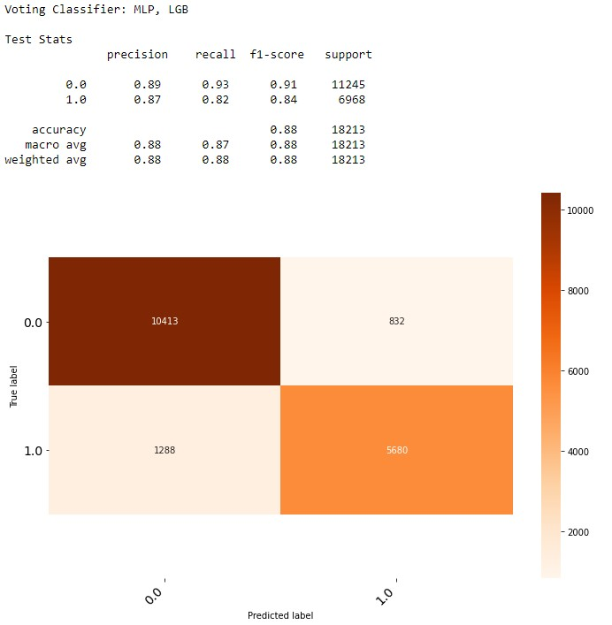
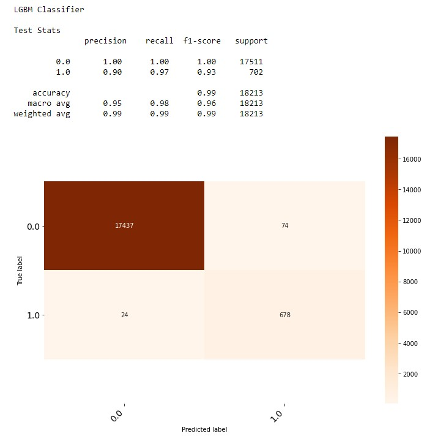

# BeOpenIT Hackathon-Data-IA-ML Team Machine Learnia
Les voyages en avion peuvent être stressants en raison de nombreux facteurs qui échappent tout simplement au contrôle des passagers. En tant que passagers, nous voulons minimiser ce stress autant que possible. Pour ce faire, nous allons éssayer de répondre à quelques inquiétude au travers des prédictions ci dessous:
- L'avion sera-t-il en retard de plus de 15 minutes?
- Le vol sera-t-il annulé?
- A quelle heure l'avion va-t-il arrivé?
- A quelle heure l'avion va-t-il décollé?

Notre étude va cépendant se limiter aux personnes prénant un vol pour Chicago ou quittant Chicago. Nous allons utiliser des données de climatique de la station OHare de Chicago provenant de [NOAA Climate Data Online: Dataset Discovery](https://www.ncdc.noaa.gov/cdo-web/datasets) et des données de diverses vols provenant du [Bureau of Transporation Statistics](http://www.transtats.bts.gov/DL_SelectFields.asp?Table_ID=236), pour réaliser nos diverses prédictions. Le notebook contenant notre travail se trouve [ici](https://github.com/Donutson/hackathon-abidjan-data-team-1/blob/main/Conseil_client.ipynb). 
Une prémière étude et traitement de nos jeux de données nous permet de retenir les variables suivantes pour nos prédictions
<table>
<tr>
<th>Variable</th>
<th>Description</th>
</tr>
<tr>
<td>DAY_OF_WEEK</td>
<td>Jour de la semaine du vol</td>
</tr>
<tr>
<td>CRS_DEP_TIME</td>
<td>CRS de l'heure de départ</td>
</tr>
<tr>
<td>DEP_TIME</td>
<td>Heure de départ prévue du vol</td>
</tr>
<tr>
<td>DEP_DEL15</td>
<td>Le vol a-t-il eu un rétard de plus de 15 minutes sur son départ, vaut 1 si oui</td>
</tr>
<tr>
<td>CRS_ARR_TIME</td>
<td>CRS de l'heure d'arrivée</td>
</tr>
<tr>
<td>ARR_TIME</td>
<td>Heure d'arrivée prévue du vol</td>
</tr>
<tr>
<td>ARR_DEL15</td>
<td>Le vol a-t-il eu un rétard de plus de 15 minutes sur son arrivée, vaut 1 si oui</td>
</tr>
<tr>
<td>CANCELLED</td>
<td>Le vol a-t-il été annulé, vaut 1 si oui</td>
</tr>
<tr>
<td>AIR_TIME</td>
<td>Durée prévue du vol en minutes</td>
</tr>
<tr>
<td>FLIGHTS</td>
<td>Nombre de vol disponible</td>
</tr>
<tr>
<td>DISTANCE</td>
<td>Distance de vol</td>
</tr>
<tr>
<td>WEATHER_DELAY</td>
<td>retard météorologique</td>
</tr>
<tr>
<td>AWND</td>
<td>La moyenne de vent/td>
</tr>
<tr>
<td>PRCPK</td>
<td>Précipitations</td>
</tr>
<tr>
<td>SNOW</td>
<td>Quantité de neige</td>
</tr>
<tr>
<td>TMAX</td>
<td>Température moyenne</td>
</tr>
</table>
Nos 2 prémières préoccupations sont des problèmes de classification tandis que les 2 dernières sont des problèmes de régression, nous utilisons plusieurs algorithmes pour chacun d'eux, les algorithmes utilisés sont les suivants:
- Decision Tree Classifier
- Random Forest Classifier
- LGBM Classifier
- XGB Classifier
- MLP Classifier
- K-Nearest Neighbors
- Logistic Regression
- Voting Classifier

### L'avion sera-t-il en retard de plus de 15 minutes?
ARR_DEL15 est notre target et nous avons retirer les variables CANCELLED, ARR_TIME et DEP_TIME des features car celles-ci ne peuvent être connue au moment de faire des prédictions de ARR_DEL15.
Le voting classifier utilisat MLP et LGB nous donne la méilleur précision de 88.55%

### Le vol sera-t-il annulé?
CANCELLED est notre target et nous avons retirer les variables ARR_DEL15, ARR_TIME et DEP_TIME des features car celles-ci ne peuvent être connue au moment de faire des prédictions de CANCELLED.
Le LGBM Classifier nous donne la méilleur précision de 99.53%

### A quelle heure l'avion va-t-il arrivé?
ARR_TIME est notre target. On effectue juste une régression linéaire et obtenons un r2 de 0.60 qui atteste d'une faible linéarité entre le temps d'arriver et les autres variables choisie
### A quelle heure l'avion va-t-il décollé?
ARR_DEL15 est notre target. On effectue juste une régression linéaire et obtenons un r2 de 0.91, contrairement au temps d'arrivé, un retard de plus de 15 minutes est grande linéaire des autres variables.
